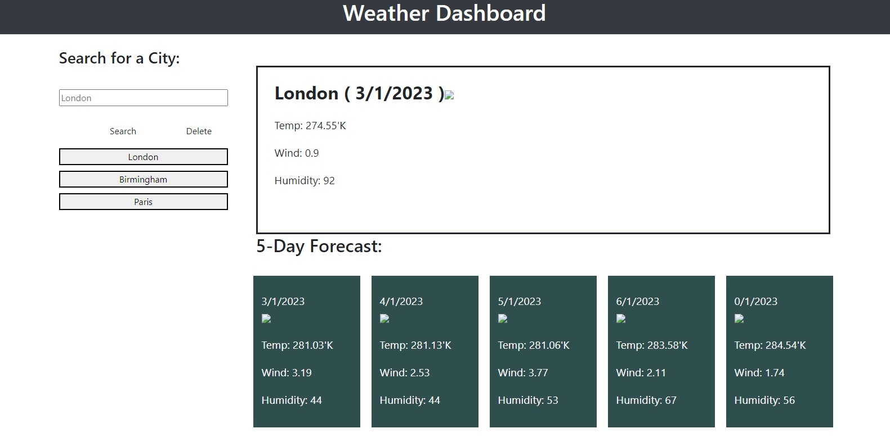
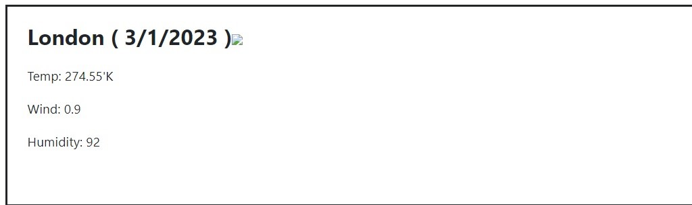
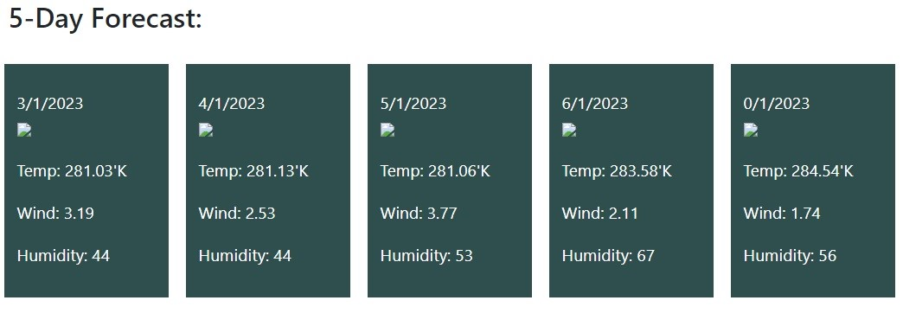
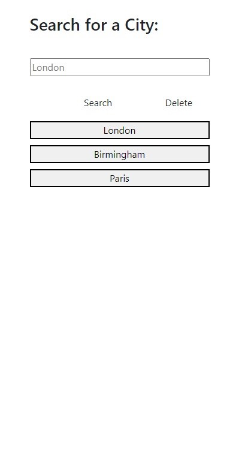

# Weather_Dashboard
This applications display a five day weather forecast for the selected city. The application makes two calls to the openweather API. The first call retrieves the coordinates of the selected city and the second retrieves the weather infomation for the day and the forecast for the next seven days. A display of the retrieve data for London city is shown below. 

## Todays Weather
The image below which is located on the top right hand side of the dashboard displays the days weather. The heading shows the name of the selected city, the date and an weather icon represetative of the weather. The data below the heading contains: temperature in kelvin, wind speed and humidity.

## 5-Day Forecast
The dashboard also displays the weathercast for the following five days. Each day is summarised in a rectangular box with the date at the top followed by icon, temperature, wind speed and humidity. The next four boxes displays the corresonding data for the subsequent days. An illustration of the forecast is provided below; 

## City Search
The application provides the user with a facility to search for any city in the world. The history of the search is retained in the form of a button below the search box. The user can toggle between the cities to view corresponding weather information. The user also has the ability to remove a city from the history list using the delete button. An image of the search panel is provided below:

## Data Storage
The name of each city searched for is stored in the local storage area unless deleted by the user. This array of cities is used to facilitate the toggling of the weather data for the cities retained by the user. 

## Application
Click the link below to view the application.
https://amoham1811.github.io/Weather_Dashboard/